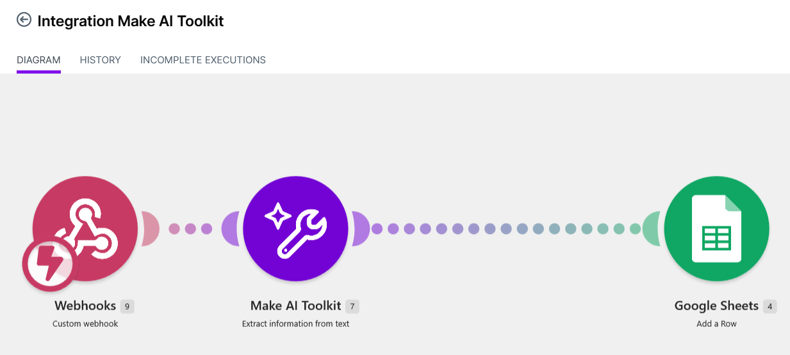

# AI-asiakasviestien automaatio

## Projektin tavoite

Projektissa rakensin Make-alustalla AI-automaation, joka käsittelee asiakasviestejä automaattisesti.

Automaatio:
- vastaanottaa asiakasviestin webhookin kautta
- luokittelee viestin
- määrittää viestin prioriteetin
- muodostaa lyhyen yhteenvedon
- tuottaa asiakkaalle vastausluonnoksen
- tallentaa tulokset Google Sheetsiin

## Automaation rakenne

Webhook → Make AI Toolkit → Google Sheets

## Käytetyt työkalut

- Make
- Make AI Toolkit
- Webhooks
- Google Sheets
- tekoälypohjainen tekstin analysointi

## Esimerkki

Asiakasviesti:

> Tuote saapui rikkinäisenä ja haluan tehdä reklamaation.

Automaatio käsittelee viestin ja muodostaa esimerkiksi:

- **Luokka:** Reklamaatio
- **Prioriteetti:** Normaali
- **Yhteenveto:** Asiakas ilmoittaa rikkinäisenä saapuneesta tuotteesta.
- **AI:n vastaus:** Asiakkaalle muodostettu vastausluonnos.

  ## Kuvakaappaukset

### Automaation rakenne

### Automaation tulokset

## Mitä projekti osoittaa?

Projekti osoittaa käytännössä, miten tekoälyä voidaan yhdistää liiketoimintaprosessien automatisointiin ja manuaalisen työn vähentämiseen.
