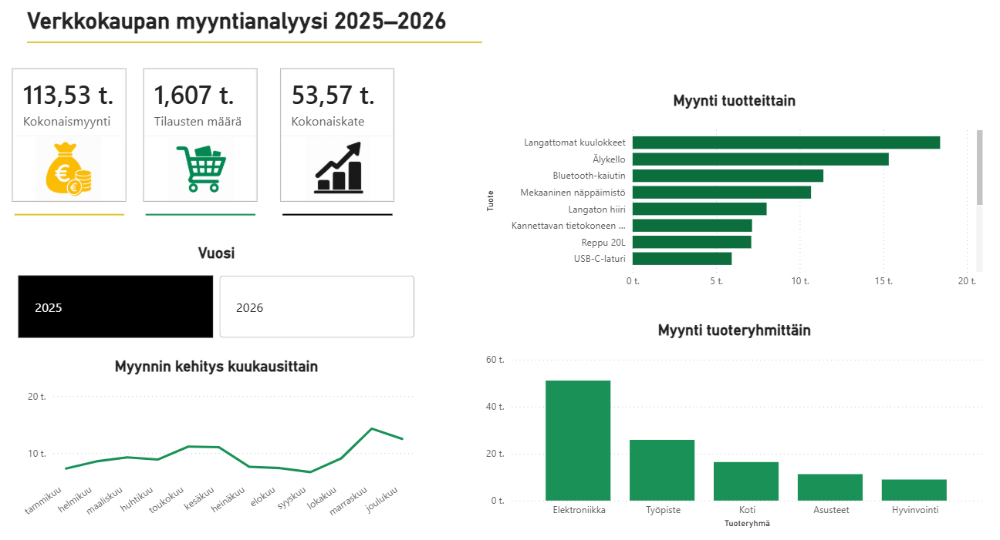

# Verkkokaupan myyntianalyysi 2025–2026

Power BI:llä toteutettu data-analytiikan portfolioharjoitus kuvitteellisen verkkokaupan myyntidatasta.

## Power BI -dashboard

## Projektin tavoite

Tavoitteena oli analysoida verkkokaupan myyntiä ja rakentaa selkeä liiketoimintaa tukeva Power BI -dashboard.

## Analyysissä tarkastellaan

- kokonaismyyntiä
- tilausten määrää
- kokonaiskatetta
- myynnin kehitystä kuukausittain
- myyntiä tuotteittain
- myyntiä tuoteryhmittäin

## Työkalut

- Power BI
- Power Query
- Excel
- DAX

## Keskeisiä havaintoja

- Elektroniikka on suurin tuoteryhmä myynnillä mitattuna.
- Langattomat kuulokkeet kuuluvat parhaiten myyviin tuotteisiin.
- Myynnissä esiintyy kuukausittaista vaihtelua.
- Dashboardilla voidaan tarkastella vuosia 2025 ja 2026 erikseen.

## Aineisto

Projektissa käytetty verkkokaupan myyntiaineisto on kuvitteellinen ja luotu portfolioharjoitusta varten.
